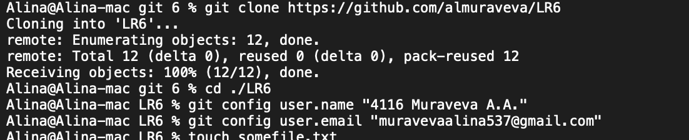
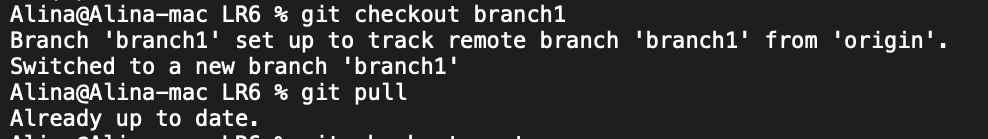
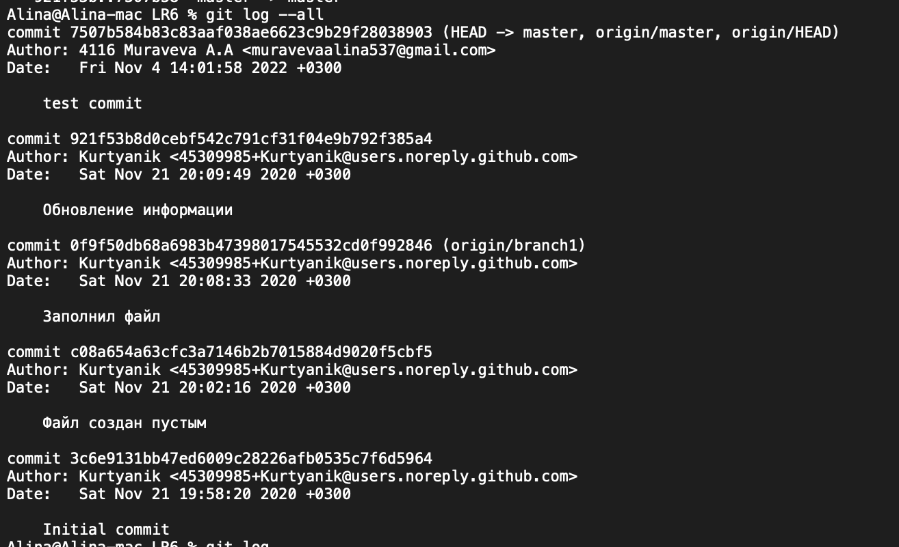
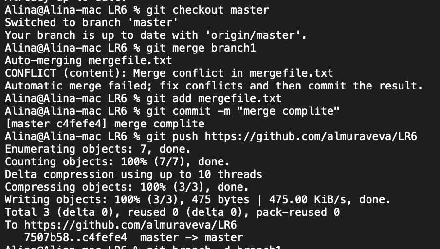
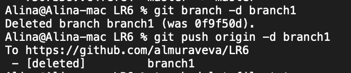
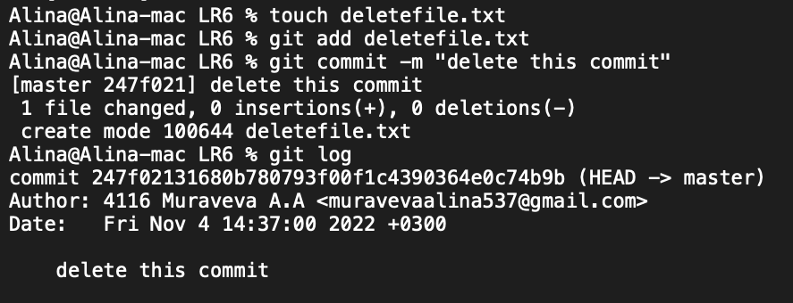
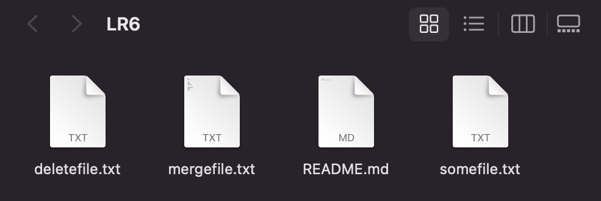
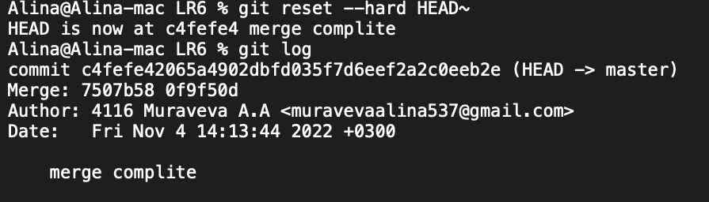
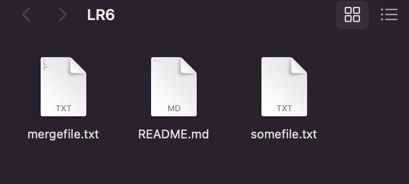
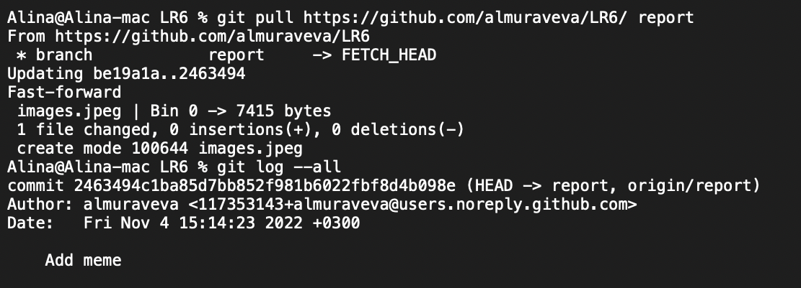

# LR6

Лабораторная работа №6

## Цель лаболаторной работы

изучение базовых возможностей системы управления версиями, опыт работы с Git Api, опыт работы с локальным и удаленным репозиторием.

## Команды терминала

```sh
Alina@Alina-macLast login: Fri Nov  4 13:56:07 on ttys001
Alina@Alina-mac git 6 % git clone https://github.com/almuraveva/LR6
Cloning into 'LR6'...
remote: Enumerating objects: 12, done.
remote: Total 12 (delta 0), reused 0 (delta 0), pack-reused 12
Receiving objects: 100% (12/12), done.
Alina@Alina-mac git 6 % cd ./LR6 
Alina@Alina-mac LR6 % git config user.name "4116 Muraveva A.A."
Alina@Alina-mac LR6 % git config user.email "muravevaalina537@gmail.com"
Alina@Alina-mac LR6 % touch somefile.txt 
Alina@Alina-mac LR6 % ls somefile.txt 
somefile.txt
Alina@Alina-mac LR6 % git add somefile.txt                           
Alina@Alina-mac LR6 % git commit -m "test commit"
[master 7507b58] test commit
 1 file changed, 0 insertions(+), 0 deletions(-)
 create mode 100644 somefile.txt
Alina@Alina-mac LR6 % git push
Username for 'https://github.com': muravevaalina537@gmail.com    
Password for 'https://muravevaalina537@gmail.com@github.com': 
Enumerating objects: 4, done.
Counting objects: 100% (4/4), done.
Delta compression using up to 10 threads
Compressing objects: 100% (2/2), done.
Writing objects: 100% (3/3), 315 bytes | 315.00 KiB/s, done.
Total 3 (delta 0), reused 0 (delta 0), pack-reused 0
To https://github.com/almuraveva/LR6
   921f53b..7507b58  master -> master
Alina@Alina-mac LR6 % git log --all
commit 7507b584b83c83aaf038ae6623c9b29f28038903 (HEAD -> master, origin/master, origin/HEAD)
Author: 4116 Muraveva A.A <muravevaalina537@gmail.com>
Date:   Fri Nov 4 14:01:58 2022 +0300

    test commit

commit 921f53b8d0cebf542c791cf31f04e9b792f385a4
Author: Kurtyanik <45309985+Kurtyanik@users.noreply.github.com>
Date:   Sat Nov 21 20:09:49 2020 +0300

    Обновление информации

commit 0f9f50db68a6983b47398017545532cd0f992846 (origin/branch1)
Author: Kurtyanik <45309985+Kurtyanik@users.noreply.github.com>
Date:   Sat Nov 21 20:08:33 2020 +0300

    Заполнил файл

commit c08a654a63cfc3a7146b2b7015884d9020f5cbf5
Author: Kurtyanik <45309985+Kurtyanik@users.noreply.github.com>
Date:   Sat Nov 21 20:02:16 2020 +0300

    Файл создан пустым

commit 3c6e9131bb47ed6009c28226afb0535c7f6d5964
Author: Kurtyanik <45309985+Kurtyanik@users.noreply.github.com>
Date:   Sat Nov 21 19:58:20 2020 +0300

    Initial commit
Alina@Alina-mac LR6 % git log 
commit 7507b584b83c83aaf038ae6623c9b29f28038903 (HEAD -> master, origin/master, origin/HEAD)
Author: 4116 Muraveva A.A <muravevaalina537@gmail.com>
Date:   Fri Nov 4 14:01:58 2022 +0300

    test commit

commit 921f53b8d0cebf542c791cf31f04e9b792f385a4
Author: Kurtyanik <45309985+Kurtyanik@users.noreply.github.com>
Date:   Sat Nov 21 20:09:49 2020 +0300

    Обновление информации

commit c08a654a63cfc3a7146b2b7015884d9020f5cbf5
Author: Kurtyanik <45309985+Kurtyanik@users.noreply.github.com>
Date:   Sat Nov 21 20:02:16 2020 +0300

    Файл создан пустым

commit 3c6e9131bb47ed6009c28226afb0535c7f6d5964
Author: Kurtyanik <45309985+Kurtyanik@users.noreply.github.com>
Date:   Sat Nov 21 19:58:20 2020 +0300

    Initial commit
Alina@Alina-mac LR6 % git show 7507b584b83c83aaf038ae6623c9b29f28038903
commit 7507b584b83c83aaf038ae6623c9b29f28038903 (HEAD -> master, origin/master, origin/HEAD)
Author: 4116 Muraveva A.A <muravevaalina537@gmail.com>
Date:   Fri Nov 4 14:01:58 2022 +0300

    test commit

diff --git a/somefile.txt b/somefile.txt
new file mode 100644
index 0000000..e69de29
Alina@Alina-mac LR6 % git show 921f53b8d0cebf542c791cf31f04e9b792f385a4
commit 921f53b8d0cebf542c791cf31f04e9b792f385a4
Author: Kurtyanik <45309985+Kurtyanik@users.noreply.github.com>
Date:   Sat Nov 21 20:09:49 2020 +0300

    Обновление информации

diff --git a/mergefile.txt b/mergefile.txt
index 8b13789..6c1c959 100644
--- a/mergefile.txt
+++ b/mergefile.txt
@@ -1 +1,5 @@
-
+Файл
+заполнен
+очень
+важной
+информацией
Alina@Alina-mac LR6 % git checkout branch1
Branch 'branch1' set up to track remote branch 'branch1' from 'origin'.
Switched to a new branch 'branch1'
Alina@Alina-mac LR6 % git pull            
Already up to date.
Alina@Alina-mac LR6 % git checkout master 
Switched to branch 'master'
Your branch is up to date with 'origin/master'.
Alina@Alina-mac LR6 % git merge branch1
Auto-merging mergefile.txt
CONFLICT (content): Merge conflict in mergefile.txt
Automatic merge failed; fix conflicts and then commit the result.
Alina@Alina-mac LR6 % git add mergefile.txt 
Alina@Alina-mac LR6 % git commit -m "merge complite"
[master c4fefe4] merge complite
Alina@Alina-mac LR6 % git push https://github.com/almuraveva/LR6
Enumerating objects: 7, done.
Counting objects: 100% (7/7), done.
Delta compression using up to 10 threads
Compressing objects: 100% (3/3), done.
Writing objects: 100% (3/3), 475 bytes | 475.00 KiB/s, done.
Total 3 (delta 0), reused 0 (delta 0), pack-reused 0
To https://github.com/almuraveva/LR6
   7507b58..c4fefe4  master -> master
Alina@Alina-mac LR6 % git branch -d branch1
Deleted branch branch1 (was 0f9f50d).
Alina@Alina-mac LR6 % git push origin -d branch1
To https://github.com/almuraveva/LR6
 - [deleted]         branch1
Alina@Alina-mac LR6 % touch deletefile.txt
Alina@Alina-mac LR6 % git add deletefile.txt 
Alina@Alina-mac LR6 % git commit -m "delete this commit"
[master 247f021] delete this commit
 1 file changed, 0 insertions(+), 0 deletions(-)
 create mode 100644 deletefile.txt
Alina@Alina-mac LR6 % git log
commit 247f02131680b780793f00f1c4390364e0c74b9b (HEAD -> master)
Author: 4116 Muraveva A.A <muravevaalina537@gmail.com>
Date:   Fri Nov 4 14:37:00 2022 +0300

    delete this commit

commit c4fefe42065a4902dbfd035f7d6eef2a2c0eeb2e
Merge: 7507b58 0f9f50d
Author: 4116 Muraveva A.A <muravevaalina537@gmail.com>
Date:   Fri Nov 4 14:13:44 2022 +0300

    merge complite

commit 7507b584b83c83aaf038ae6623c9b29f28038903 (origin/master, origin/HEAD)
Author: 4116 Muraveva A.A <muravevaalina537@gmail.com>
Date:   Fri Nov 4 14:01:58 2022 +0300

    test commit

commit 921f53b8d0cebf542c791cf31f04e9b792f385a4
Author: Kurtyanik <45309985+Kurtyanik@users.noreply.github.com>
Date:   Sat Nov 21 20:09:49 2020 +0300

    Обновление информации

commit 0f9f50db68a6983b47398017545532cd0f992846
Author: Kurtyanik <45309985+Kurtyanik@users.noreply.github.com>
Date:   Sat Nov 21 20:08:33 2020 +0300

    Заполнил файл

commit c08a654a63cfc3a7146b2b7015884d9020f5cbf5
Author: Kurtyanik <45309985+Kurtyanik@users.noreply.github.com>
Date:   Sat Nov 21 20:02:16 2020 +0300

    Файл создан пустым

commit 3c6e9131bb47ed6009c28226afb0535c7f6d5964
Author: Kurtyanik <45309985+Kurtyanik@users.noreply.github.com>
Date:   Sat Nov 21 19:58:20 2020 +0300

    Initial commit

zsh: suspended  git log
Alina@Alina-mac LR6 % git reset --hard HEAD~
HEAD is now at c4fefe4 merge complite
Alina@Alina-mac LR6 % git log 
commit c4fefe42065a4902dbfd035f7d6eef2a2c0eeb2e (HEAD -> master)
Merge: 7507b58 0f9f50d
Author: 4116 Muraveva A.A <muravevaalina537@gmail.com>
Date:   Fri Nov 4 14:13:44 2022 +0300

    merge complite

commit 7507b584b83c83aaf038ae6623c9b29f28038903 (origin/master, origin/HEAD)
Author: 4116 Muraveva A.A <muravevaalina537@gmail.com>
Date:   Fri Nov 4 14:01:58 2022 +0300

    test commit

commit 921f53b8d0cebf542c791cf31f04e9b792f385a4
Author: Kurtyanik <45309985+Kurtyanik@users.noreply.github.com>
Date:   Sat Nov 21 20:09:49 2020 +0300

    Обновление информации

commit 0f9f50db68a6983b47398017545532cd0f992846
Author: Kurtyanik <45309985+Kurtyanik@users.noreply.github.com>
Date:   Sat Nov 21 20:08:33 2020 +0300

    Заполнил файл

commit c08a654a63cfc3a7146b2b7015884d9020f5cbf5
Author: Kurtyanik <45309985+Kurtyanik@users.noreply.github.com>
Date:   Sat Nov 21 20:02:16 2020 +0300

    Файл создан пустым

commit 3c6e9131bb47ed6009c28226afb0535c7f6d5964
Author: Kurtyanik <45309985+Kurtyanik@users.noreply.github.com>
Date:   Sat Nov 21 19:58:20 2020 +0300

    Initial commit
Alina@Alina-mac LR6 % git push https://github.com/almuraveva/LR6
Everything up-to-date
Alina@Alina-mac LR6 % touch "terminal log.txt"
Alina@Alina-mac LR6 % add "terminal log.txt" 
zsh: command not found: add
Alina@Alina-mac LR6 % git add "terminal log.txt" 
Alina@Alina-mac LR6 % git add images 
Alina@Alina-mac LR6 % git commit -m "create log and images"
[master 26d49d9] create log and images
 1 file changed, 0 insertions(+), 0 deletions(-)
 create mode 100644 terminal log.txt
Alina@Alina-mac LR6 % git push https://github.com/almuraveva/LR6
Enumerating objects: 3, done.
Counting objects: 100% (3/3), done.
Delta compression using up to 10 threads
Compressing objects: 100% (2/2), done.
Writing objects: 100% (2/2), 259 bytes | 259.00 KiB/s, done.
Total 2 (delta 1), reused 0 (delta 0), pack-reused 0
remote: Resolving deltas: 100% (1/1), completed with 1 local object.
To https://github.com/almuraveva/LR6
   c4fefe4..26d49d9  master -> master
Alina@Alina-mac LR6 % git branch report
Alina@Alina-mac LR6 % git checkout report
Switched to branch 'report'
Alina@Alina-mac LR6 % touch history.txt
Alina@Alina-mac LR6 % git add history.txt 
Alina@Alina-mac LR6 % git commit -m "create history commands"
[report be19a1a] create history commands
 1 file changed, 0 insertions(+), 0 deletions(-)
 create mode 100644 history.txt
Alina@Alina-mac LR6 % git push https://github.com/almuraveva/LR6
Enumerating objects: 3, done.
Counting objects: 100% (3/3), done.
Delta compression using up to 10 threads
Compressing objects: 100% (2/2), done.
Writing objects: 100% (2/2), 252 bytes | 252.00 KiB/s, done.
Total 2 (delta 1), reused 0 (delta 0), pack-reused 0
remote: Resolving deltas: 100% (1/1), completed with 1 local object.
remote: 
remote: Create a pull request for 'report' on GitHub by visiting:
remote:      https://github.com/almuraveva/LR6/pull/new/report
remote: 
To https://github.com/almuraveva/LR6
 * [new branch]      report -> report
Alina@Alina-mac LR6 % git log --all
commit be19a1aa0eb6723673d4fcfe6a590b40b0b4c220 (HEAD -> report)
Author: 4116 Muraveva A.A <muravevaalina537@gmail.com>
Date:   Fri Nov 4 14:56:07 2022 +0300

    create history commands

commit 26d49d9dc9afd7cbaed8b735acb51d8a637a40b9 (master)
Author: 4116 Muraveva A.A <muravevaalina537@gmail.com>
Date:   Fri Nov 4 14:50:41 2022 +0300

    create log and images

commit c4fefe42065a4902dbfd035f7d6eef2a2c0eeb2e
Merge: 7507b58 0f9f50d
Author: 4116 Muraveva A.A <muravevaalina537@gmail.com>
Date:   Fri Nov 4 14:13:44 2022 +0300

    merge complite

commit 7507b584b83c83aaf038ae6623c9b29f28038903 (origin/master, origin/HEAD)
Author: 4116 Muraveva A.A <muravevaalina537@gmail.com>
Date:   Fri Nov 4 14:01:58 2022 +0300

    test commit

commit 921f53b8d0cebf542c791cf31f04e9b792f385a4
Author: Kurtyanik <45309985+Kurtyanik@users.noreply.github.com>
Date:   Sat Nov 21 20:09:49 2020 +0300

    Обновление информации

commit 0f9f50db68a6983b47398017545532cd0f992846
Author: Kurtyanik <45309985+Kurtyanik@users.noreply.github.com>
Date:   Sat Nov 21 20:08:33 2020 +0300

    Заполнил файл

commit c08a654a63cfc3a7146b2b7015884d9020f5cbf5
Author: Kurtyanik <45309985+Kurtyanik@users.noreply.github.com>
Date:   Sat Nov 21 20:02:16 2020 +0300

    Файл создан пустым

commit 3c6e9131bb47ed6009c28226afb0535c7f6d5964
Author: Kurtyanik <45309985+Kurtyanik@users.noreply.github.com>
Date:   Sat Nov 21 19:58:20 2020 +0300

    Initial commit

zsh: suspended  git log --all
Alina@Alina-mac LR6 % git pull
remote: Enumerating objects: 3, done.
remote: Counting objects: 100% (3/3), done.
remote: Compressing objects: 100% (3/3), done.
remote: Total 3 (delta 0), reused 0 (delta 0), pack-reused 0
Unpacking objects: 100% (3/3), 7.87 KiB | 1.97 MiB/s, done.
From https://github.com/almuraveva/LR6
   7507b58..26d49d9  master     -> origin/master
 * [new branch]      report     -> origin/report
There is no tracking information for the current branch.
Please specify which branch you want to merge with.
See git-pull(1) for details.

    git pull <remote> <branch>

If you wish to set tracking information for this branch you can do so with:

    git branch --set-upstream-to=origin/<branch> report

Alina@Alina-mac LR6 % git pull https://github.com/almuraveva/LR6/ report    
From https://github.com/almuraveva/LR6
 * branch            report     -> FETCH_HEAD
Updating be19a1a..2463494
Fast-forward
 images.jpeg | Bin 0 -> 7415 bytes
 1 file changed, 0 insertions(+), 0 deletions(-)
 create mode 100644 images.jpeg
Alina@Alina-mac LR6 % git log --all
commit 2463494c1ba85d7bb852f981b6022fbf8d4b098e (HEAD -> report, origin/report)
Author: almuraveva <117353143+almuraveva@users.noreply.github.com>
Date:   Fri Nov 4 15:14:23 2022 +0300

    Add meme

commit be19a1aa0eb6723673d4fcfe6a590b40b0b4c220
Author: 4116 Muraveva A.A <muravevaalina537@gmail.com>
Date:   Fri Nov 4 14:56:07 2022 +0300

    create history commands

commit 26d49d9dc9afd7cbaed8b735acb51d8a637a40b9 (origin/master, origin/HEAD, master)
Author: 4116 Muraveva A.A <muravevaalina537@gmail.com>
Date:   Fri Nov 4 14:50:41 2022 +0300

    create log and images

commit c4fefe42065a4902dbfd035f7d6eef2a2c0eeb2e
Merge: 7507b58 0f9f50d
Author: 4116 Muraveva A.A <muravevaalina537@gmail.com>
Date:   Fri Nov 4 14:13:44 2022 +0300

    merge complite

commit 7507b584b83c83aaf038ae6623c9b29f28038903
Author: 4116 Muraveva A.A <muravevaalina537@gmail.com>
Date:   Fri Nov 4 14:01:58 2022 +0300

    test commit

commit 921f53b8d0cebf542c791cf31f04e9b792f385a4
Author: Kurtyanik <45309985+Kurtyanik@users.noreply.github.com>
Date:   Sat Nov 21 20:09:49 2020 +0300

    Обновление информации

commit 0f9f50db68a6983b47398017545532cd0f992846
Author: Kurtyanik <45309985+Kurtyanik@users.noreply.github.com>
Date:   Sat Nov 21 20:08:33 2020 +0300

    Заполнил файл

commit c08a654a63cfc3a7146b2b7015884d9020f5cbf5
Author: Kurtyanik <45309985+Kurtyanik@users.noreply.github.com>
Date:   Sat Nov 21 20:02:16 2020 +0300

    Файл создан пустым

commit 3c6e9131bb47ed6009c28226afb0535c7f6d5964
Author: Kurtyanik <45309985+Kurtyanik@users.noreply.github.com>
Date:   Sat Nov 21 19:58:20 2020 +0300

    Initial commit

zsh: suspended  git log --all
Alina@Alina-mac LR6 % 

```

## Ход работы

* Клонируем репозиторий и настраиваем профиль
    
* Скачиваем вторую ветку
    
* Выводим всю историю
    
* Сливаем 2 ветки в одну
    
* Удаляем вторую ветку
    
* Создаем комит, который будем удалять
    
    пакпка до
    
* Удаляем этот комит
    
    папка после
    
* Создаем файл в удаленном репозитории и обновляем локальный
     
* Финальная история изменений

``` sh
Alina@Alina-mac LR6 % git log --all
commit 2463494c1ba85d7bb852f981b6022fbf8d4b098e (HEAD -> report, origin/report)
Author: almuraveva <117353143+almuraveva@users.noreply.github.com>
Date:   Fri Nov 4 15:14:23 2022 +0300

    Add meme

commit be19a1aa0eb6723673d4fcfe6a590b40b0b4c220
Author: 4116 Muraveva A.A <muravevaalina537@gmail.com>
Date:   Fri Nov 4 14:56:07 2022 +0300

    create history commands

commit 26d49d9dc9afd7cbaed8b735acb51d8a637a40b9 (origin/master, origin/HEAD, master)
Author: 4116 Muraveva A.A <muravevaalina537@gmail.com>
Date:   Fri Nov 4 14:50:41 2022 +0300

    create log and images

commit c4fefe42065a4902dbfd035f7d6eef2a2c0eeb2e
Merge: 7507b58 0f9f50d
Author: 4116 Muraveva A.A <muravevaalina537@gmail.com>
Date:   Fri Nov 4 14:13:44 2022 +0300

    merge complite

commit 7507b584b83c83aaf038ae6623c9b29f28038903
Author: 4116 Muraveva A.A <muravevaalina537@gmail.com>
Date:   Fri Nov 4 14:01:58 2022 +0300

    test commit

commit 921f53b8d0cebf542c791cf31f04e9b792f385a4
Author: Kurtyanik <45309985+Kurtyanik@users.noreply.github.com>
Date:   Sat Nov 21 20:09:49 2020 +0300

    Обновление информации

commit 0f9f50db68a6983b47398017545532cd0f992846
Author: Kurtyanik <45309985+Kurtyanik@users.noreply.github.com>
Date:   Sat Nov 21 20:08:33 2020 +0300

    Заполнил файл

commit c08a654a63cfc3a7146b2b7015884d9020f5cbf5
Author: Kurtyanik <45309985+Kurtyanik@users.noreply.github.com>
Date:   Sat Nov 21 20:02:16 2020 +0300

    Файл создан пустым

commit 3c6e9131bb47ed6009c28226afb0535c7f6d5964
Author: Kurtyanik <45309985+Kurtyanik@users.noreply.github.com>
Date:   Sat Nov 21 19:58:20 2020 +0300

    Initial commit
```

## Вывод

Мы изучили базовые возможности системы управления версиями, получили опыт работы с Git Api и опыт работы с локальным и удаленным репозиторием.
